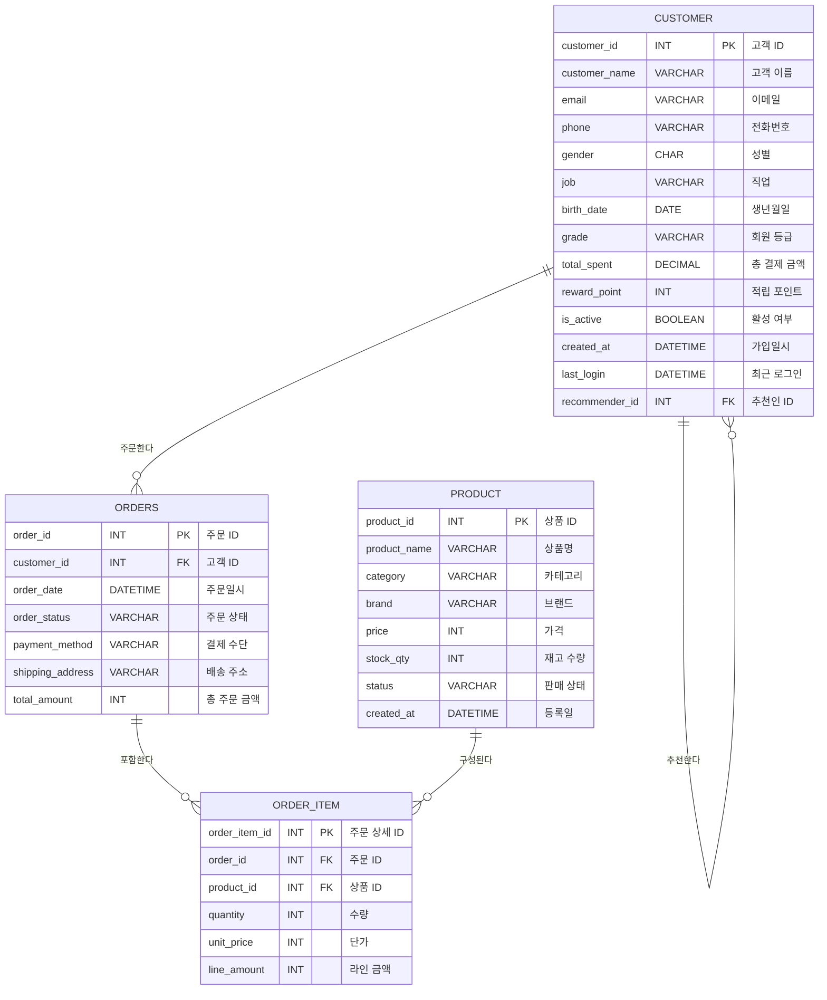

```mermaid
erDiagram
    CUSTOMER ||--o{ ORDERS : 주문한다
    ORDERS ||--o{ ORDER_ITEM : 포함한다
    PRODUCT ||--o{ ORDER_ITEM : 구성된다
    CUSTOMER ||--o{ CUSTOMER : 추천한다

    CUSTOMER {
        customer_id INT PK "고객 ID"
        customer_name VARCHAR "고객 이름"
        email VARCHAR "이메일"
        phone VARCHAR "전화번호"
        gender CHAR "성별"
        job VARCHAR "직업"
        birth_date DATE "생년월일"
        grade VARCHAR "회원 등급"
        total_spent DECIMAL "총 결제 금액"
        reward_point INT "적립 포인트"
        is_active BOOLEAN "활성 여부"
        created_at DATETIME "가입일시"
        last_login DATETIME "최근 로그인"
        recommender_id INT FK "추천인 ID"
    }

    PRODUCT {
        product_id INT PK "상품 ID"
        product_name VARCHAR "상품명"
        category VARCHAR "카테고리"
        brand VARCHAR "브랜드"
        price INT "가격"
        stock_qty INT "재고 수량"
        status VARCHAR "판매 상태"
        created_at DATETIME "등록일"
    }

    ORDERS {
        order_id INT PK "주문 ID"
        customer_id INT FK "고객 ID"
        order_date DATETIME "주문일시"
        order_status VARCHAR "주문 상태"
        payment_method VARCHAR "결제 수단"
        shipping_address VARCHAR "배송 주소"
        total_amount INT "총 주문 금액"
    }

    ORDER_ITEM {
        order_item_id INT PK "주문 상세 ID"
        order_id INT FK "주문 ID"
        product_id INT FK "상품 ID"
        quantity INT "수량"
        unit_price INT "단가"
        line_amount INT "라인 금액"
    }
```